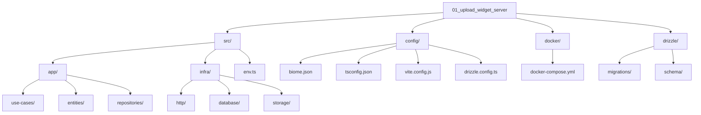

# Upload Widget Server

Este é um servidor backend para gerenciamento de uploads de arquivos, construído com Fastify, TypeScript e integração com Cloudfare R2.

## 🚀 Tecnologias

- [Fastify](https://www.fastify.io/) - Framework web rápido e de baixo overhead
- [TypeScript](https://www.typescriptlang.org/) - Superset JavaScript com tipagem estática
- [Drizzle ORM](https://orm.drizzle.team/) - ORM TypeScript-first
- [PostgreSQL](https://www.postgresql.org/) - Banco de dados relacional
- [Zod](https://zod.dev/) - Validação de esquemas TypeScript
- [Vitest](https://vitest.dev/) - Framework de testes
- [Swagger](https://swagger.io/) - Documentação da API
- [Biome](https://biomejs.dev/) - Linter e formatter

## 📦 Estrutura do Repositório



## 📋 Pré-requisitos

- Node.js (versão LTS recomendada)
- pnpm (versão 10.12.1 ou superior)
- Docker e Docker Compose
- Conta Cloudfare com acesso ao Object Storage

## 🔧 Configuração

1. Clone o repositório:

```bash
git clone git@github.com:polinelottin/01_upload_widget_server.git
cd 01_upload_widget_server
```

2. Instale as dependências:

```bash
pnpm install
```

3. Configure as variáveis de ambiente:
   Crie um arquivo `.env` na raiz do projeto com as seguintes variáveis:

```env
DATABASE_URL=
CLOUDFARE_ACCOUNT_ID=
CLOUDFARE_ACCESS_KEY_ID=
CLOUDFARE_SECRET_ACCESS_KEY_ID=
CLOUDFARE_BUCKET=
CLOUDFARE_PUBLIC_URL=
```

4. Inicie o banco de dados PostgreSQL usando Docker:

```bash
docker-compose up -d
```

## 🚀 Executando o projeto

Para iniciar o servidor em modo de desenvolvimento:

```bash
pnpm dev
```

## 📝 Scripts Disponíveis

- `pnpm dev` - Inicia o servidor em modo de desenvolvimento
- `pnpm test` - Executa os testes
- `pnpm test:watch` - Executa os testes em modo watch
- `pnpm db:generate` - Gera as migrações do banco de dados
- `pnpm db:migrate` - Executa as migrações do banco de dados
- `pnpm db:studio` - Abre o Drizzle Studio para gerenciar o banco de dados
- `pnpm db:migrate:test` - Executa as migrações do banco de dados para testes
- `pnpm build` - Compila o projeto para produção

## 📁 Estrutura do Projeto

```
src/
├── app/         # Lógica de negócios e casos de uso
├── infra/       # Configurações de infraestrutura
└── env.ts       # Configuração de variáveis de ambiente
```

## 🧪 Testes

O projeto utiliza Vitest para testes. Para executar os testes:

```bash
pnpm test
```

Para executar os testes em modo watch:

```bash
pnpm test:watch
```

## 📄 Licença

Este projeto está sob a licença ISC.
